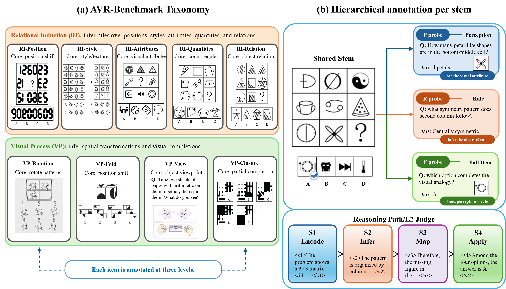
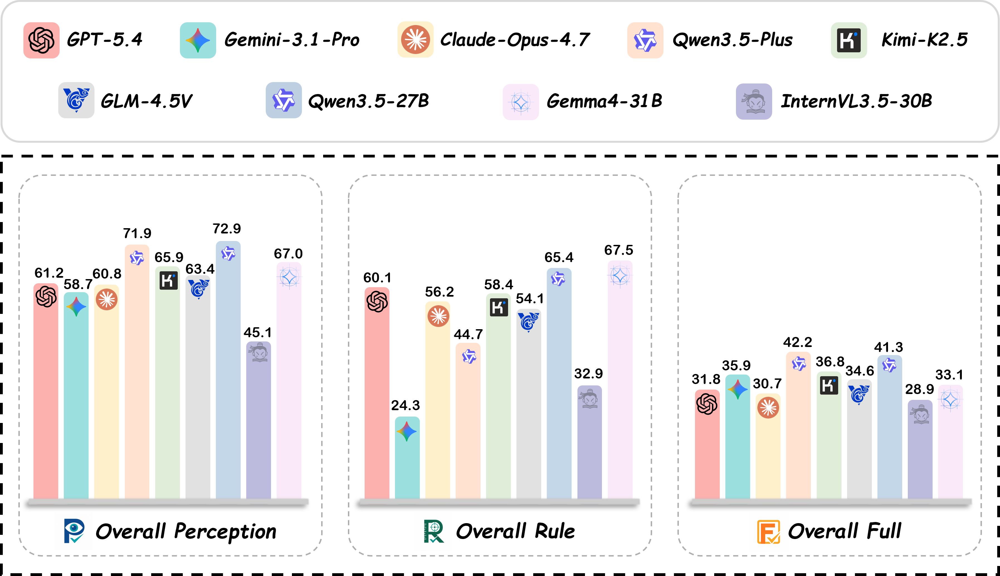

<h1 align="center">StemBind: When MLLMs Get Lost Between Rules and Instances in Abstract Visual Reasoning</h1>

<p align="center">
  <a href="https://arxiv.org/abs/XXXX.XXXXX"></a>
  <a href="https://hexixiang.github.io/StemBind/"></a>
  <a href="https://huggingface.co/datasets/user48271/Stembind"></a>
  <a href="LICENSE"></a>
</p>

<p align="center">
  
</p>

**StemBind** is a shared-stem diagnostic benchmark for abstract visual reasoning (AVR). MLLMs often *know the rule but pick the wrong answer*: a model can describe what it sees and name the underlying pattern, yet still fail to choose the matching candidate. Existing AVR benchmarks collapse perception, rule induction, and answer selection into a single right-or-wrong signal, so they cannot tell *why* a model failed. StemBind probes the **same visual stem** three ways so a final-answer error can be attributed to a specific sub-step on the same evidence.

## ✨ Key Features

| Aspect | Details |
|---|---|
| **Shared-stem P/R/F probes** | Every stem is probed three ways on the same image: **P**erception (what is in the image), **R**ule (what pattern governs it), and **F**ull (which option completes it). |
| **Knowledge-light** | Items avoid math, physics, and world knowledge, so errors more likely reflect visual reasoning rather than memorized facts. |
| **9 auditable operations** | Rule-Induction (RI-Pos, RI-Sty, RI-Attr, RI-Qty, RI-Rel) and Visual-Processing (VP-Fold, VP-View, VP-Rot, VP-Closure), each defined by a reproducible visual operation. |
| **S1–S4 process annotation** | Each full item carries four Sternberg reasoning stages: **S1 Encode, S2 Infer, S3 Map, S4 Apply**. |
| **SSA intervention** | Stage-wise Stimulus Augmentation injects verified stage content cumulatively to test which stage actually repairs a failed item. |
| **Paired thinking controls** | Matched direct vs. thinking-mode runs isolate the effect of explicit reasoning. |

## 🧩 What's in StemBind

- **2,298** curated knowledge-light stems across **9** visual operations.
- **19,533** shared-stem tasks: **14,937** Perception + **2,298** Rule + **2,298** Full.
- Each full item annotated with S1–S4 process targets and a perception-load tag.
- A contamination-audited release split, plus a hidden test set with answer-mapping randomization.

## 🔑 Key Findings

Evaluating **24 frontier MLLM configurations** (proprietary and open-source):

1. **The R–F chasm.** Rule accuracy exceeds full-item accuracy on **22 of 24** models — most failures happen *after* the rule is identified.
2. **A persistent binding gap.** Even when P and R are both correct on the same stem, models still answer F incorrectly **51.2%** of the time.
3. **The bottleneck is S3.** Process diagnostics and SSA localize the dominant failure to **rule-to-instance mapping** (S3 Map).
4. **Scaling and thinking do not help.** Neither larger models nor explicit thinking mode reliably closes the gap; thinking even lowers rule and full-item accuracy.

## 🏆 Leaderboard

<p align="center">
  
</p>

Full-item accuracy stays low in absolute terms (the best open row, Qwen3.5-27B, reaches only **41.3%** F), and most rows preserve stronger P or R than F. Full per-model P/R/F results are in the paper (Table 2). An interactive leaderboard and submission instructions will be hosted here.

## 📦 Dataset

The dataset is available on HuggingFace: **[user48271/Stembind](https://huggingface.co/datasets/user48271/Stembind)**. The result-bearing split is released directly; the hidden test set is served with option shuffling and answer-mapping randomization.

## 🧪 Evaluation

The evaluation harness (P/R/F scoring, the L1/L2/L3 levels, and the SSA intervention) and leaderboard submission will be released in this repository. *Coming soon.*

## 🗂️ Repository Layout

```text
StemBind/
├── docs/        # Project page (served via GitHub Pages)
├── LICENSE      # Apache-2.0
└── README.md
```

## 📝 Citation

```bibtex
@article{he2026stembind,
  title   = {StemBind: When MLLMs Get Lost Between Rules and Instances in Abstract Visual Reasoning},
  author  = {He, Xixiang and Wu, Baiqi and Li, Xingming and Cheng, Ao and Sun, Qiyao and Ji, Xuanyu and Hu, Qingyong},
  journal = {arXiv preprint arXiv:XXXX.XXXXX},
  year    = {2026}
}
```

## License

Released under the [Apache License 2.0](LICENSE).
